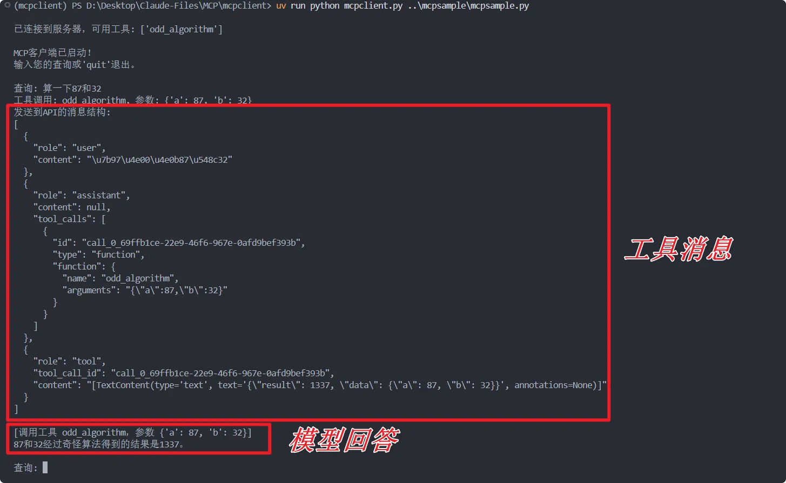

# 创建一个简单的mcp client

能创建 mcp server 就能创建一个 mcp client，但因为需要处理大模型的上下输入以及 api， 实现细节上会比 server 要复杂一点。

参考官方教程

[官方教程](https://modelcontextprotocol.io/quickstart/client)

我们还是能够实现一个简单的对话式 mcp client。

## 准备工作
之前已经开发过 mcp server，所以环境之类的配置应该已经很熟悉了，我们还是使用 uv 进行环境部署和开发，这里不再赘述。

为了使用 OpenAI 兼容的大模型接口，我们需要再特别引入 openai 库。

``` python
from openai import OpenAI
```
## 对接 mcp server
确保你有一个可以用来测试的 mcp server，为了简单方便我这里就是用之前已经创建好的“奇怪算法”的 server 用来演示。

## 完整代码
为了让你有一个宏观的认识，这里先把完整代码放出来：

``` python
import asyncio
import sys
import json
import signal
from typing import Optional, List
from contextlib import AsyncExitStack

from mcp import ClientSession, StdioServerParameters
from mcp.client.stdio import stdio_client
from openai import OpenAI

# 全局 API 配置
API_CONFIG = {
    "api_key": "your-api-key-here",
    "api_base": "API base url",     # 或其他支持OpenAI兼容API的服务
    "model": "模型名称"              # 根据您使用的API提供商进行调整
}

class MCPClient:
    def __init__(self):
        # 初始化会话和客户端对象
        self.session: Optional[ClientSession] = None
        self.exit_stack = AsyncExitStack()
        self.pending_tasks: List[asyncio.Task] = []

        # 初始化OpenAI客户端
        self.client = OpenAI(
            api_key=API_CONFIG["api_key"],
            base_url=API_CONFIG["api_base"]
        )

    async def connect_to_server(self, server_script_path: str):
        """连接到MCP服务器"""
        is_python = server_script_path.endswith('.py')
        is_js = server_script_path.endswith('.js')

        if not (is_python or is_js):
            raise ValueError("服务器脚本必须是.py或.js文件")

        command = "python" if is_python else "node"
        server_params = StdioServerParameters(
            command=command,
            args=[server_script_path],
            env=None
        )

        stdio_transport = await self.exit_stack.enter_async_context(stdio_client(server_params))
        self.stdio, self.write = stdio_transport
        self.session = await self.exit_stack.enter_async_context(ClientSession(self.stdio, self.write))
        await self.session.initialize()

        # 列出可用工具
        response = await self.session.list_tools()
        tools = response.tools
        print("\n已连接到服务器，可用工具:", [tool.name for tool in tools])

    async def process_query(self, query: str) -> str:
        """使用OpenAI兼容 API和可用工具处理查询"""
        messages = [
            {
                "role": "user",
                "content": query
            }
        ]

        response = await self.session.list_tools()
        available_tools = [{
            "type": "function",
            "function": {
                "name": tool.name,
                "description": tool.description,
                "parameters": tool.inputSchema
            }
        } for tool in response.tools]

        # 初始API调用
        try:
            response = self.client.chat.completions.create(
                model=API_CONFIG["model"],
                messages=messages,
                tools=available_tools,
                tool_choice="auto"
            )

            # 处理响应
            final_text = []

            # 获取模型的响应
            message = response.choices[0].message
            if message.content:
                final_text.append(message.content)

            # 处理工具调用
            if hasattr(message, 'tool_calls') and message.tool_calls:
                for tool_call in message.tool_calls:
                    tool_name = tool_call.function.name
                    tool_args = json.loads(tool_call.function.arguments)
                    
                    # 打印调试信息
                    print(f"工具调用: {tool_name}, 参数: {tool_args}")
                    
                    # 执行工具调用
                    result = await self.session.call_tool(tool_name, tool_args)
                    final_text.append(f"[调用工具 {tool_name}，参数 {tool_args}]")
                    
                    # 返回工具调用结果
                    tool_result = str(result.content)
                    
                    # 添加助手消息和工具结果到上下文
                    messages.append({
                        "role": "assistant",
                        "content": None,
                        "tool_calls": [
                            {
                                "id": tool_call.id,
                                "type": "function",
                                "function": {
                                    "name": tool_name,
                                    "arguments": tool_call.function.arguments
                                }
                            }
                        ]
                    })
                    
                    # 确保工具响应格式正确
                    messages.append({
                        "role": "tool",
                        "tool_call_id": tool_call.id,
                        "content": tool_result  # 使用字符串
                    })
                    
                    # 打印调试信息
                    print("发送到API的消息结构:")
                    print(json.dumps(messages, indent=2))
                    
                    # 获取下一个响应 - 使用相同的模型
                    try:
                        second_response = self.client.chat.completions.create(
                            model=API_CONFIG["model"],  # 使用全局配置的模型
                            messages=messages,
                            tools=available_tools,
                            tool_choice="auto"
                        )
                        
                        next_message = second_response.choices[0].message
                        if next_message.content:
                            final_text.append(next_message.content)
                    except Exception as e:
                        final_text.append(f"获取最终响应时出错: {str(e)}")
                        print(f"获取最终响应时出错: {str(e)}")
            
            return "\n".join(final_text)
        
        except Exception as e:
            return f"API调用出错: {str(e)}"
    
    async def chat_loop(self):
        """运行交互式聊天循环"""
        print("\nMCP客户端已启动！")
        print("输入您的查询或'quit'退出。")
        
        while True:
            try:
                query = input("\n查询: ").strip()
                if query.lower() == 'quit':
                    print("正在清理并退出...")
                    break
                
                response = await self.process_query(query)
                print("\n" + response)
            except Exception as e:
                print(f"\n错误: {str(e)}")
                import traceback
                traceback.print_exc()
    
    async def cleanup(self):
        """清理资源，简化版本，避免与anyio冲突"""
        try:
            # 简单地关闭退出栈，不使用wait_for
            await self.exit_stack.aclose()
        except Exception as e:
            # 捕获但不重新抛出异常，只是记录它们
            print(f"清理过程中出现异常 (可以忽略): {str(e)}")

async def main():
    if len(sys.argv) < 2:
        print("用法: python mcpclient.py <服务器脚本路径>")
        sys.exit(1)
    
    client = MCPClient()
    
    # Windows平台不支持add_signal_handler，省略信号处理
    
    try:
        await client.connect_to_server(sys.argv[1])
        await client.chat_loop()
    finally:
        await client.cleanup()

if __name__ == "__main__":
    try:
        asyncio.run(main())
    except KeyboardInterrupt:
        print("\n用户中断，程序退出")
    except asyncio.CancelledError:
        # 捕获并忽略取消错误
        print("程序被取消，正常退出")
    except Exception as e:
        print(f"程序异常退出: {str(e)}")
        import traceback
        traceback.print_exc()  # 打印详细的异常堆栈，便于调试
```

这个代码的功能就是能在终端中启用 mcp client，使用单轮对话的形式与 ai 完成交互。

``` python
# 全局 API 配置
API_CONFIG = {
    "api_key": "your-api-key-here",
    "api_base": "API base url",     # 或其他支持OpenAI兼容API的服务
    "model": "模型名称"              # 根据您使用的API提供商进行调整
}
```
### 基本架构
MCP 客户端的核心架构包括以下组件：

● 连接管理：与 MCP 服务器建立连接

● 消息处理：发送请求和接收响应

● 工具管理：列出可用工具并处理工具调用

● AI 交互：与 AI 模型通信

● 用户界面：提供与用户交互的方式

### 关键依赖
```python
mcp==0.1.0  # MCP 客户端库
openai==1.0.0以上  # 支持 OpenAI 兼容API的客户端
```

### 核心代码结构
一个最小化的 MCP 客户端应包括：

#### 初始化和配置
``` python
class MCPClient:
    def __init__(self):
        # 配置客户端
        self.session = None  # MCP会话
        self.exit_stack = AsyncExitStack()  # 用于资源管理
        
        # 初始化API客户端
        self.client = OpenAI(
            api_key="your-api-key",
            base_url="https://api.provider.com"
        )
```
#### 连接到服务器
``` python
async def connect_to_server(self, server_script_path):
    # 确定脚本类型和启动命令
    command = "python" if server_script_path.endswith('.py') else "node"
    
    # 设置服务器参数
    server_params = StdioServerParameters(
        command=command,
        args=[server_script_path],
        env=None
    )
    
    # 建立连接
    stdio_transport = await self.exit_stack.enter_async_context(stdio_client(server_params))
    self.stdio, self.write = stdio_transport
    self.session = await self.exit_stack.enter_async_context(ClientSession(self.stdio, self.write))
    await self.session.initialize()
    
    # 列出可用工具
    response = await self.session.list_tools()
    return response.tools
```
#### 处理查询
``` python
async def process_query(self, query):
    # 准备消息
    messages = [{"role": "user", "content": query}]
    
    # 获取可用工具
    response = await self.session.list_tools()
    available_tools = [...]  # 转换为API所需格式
    
    # 调用AI
    response = self.client.chat.completions.create(
        model="model-name",
        messages=messages,
        tools=available_tools,
        tool_choice="auto"
    )
    
    # 处理响应和工具调用
    # 如果工具被调用，执行工具并将结果返回给AI
    # ...
```
#### 资源清理
确保正确清理资源是非常重要的：

``` python
async def cleanup(self):
    try:
        await self.exit_stack.aclose()
    except Exception as e:
        print(f"清理过程中出现异常 (可以忽略): {str(e)}")
```
## 脚本使用
可以在终端中使用这个脚本，但请确保已经激活了 uv 环境：
```bash
.venv\Scripts\activate
```
我们只可以指定脚本要对接的 mcp server，可以使用相对路径，例如我想要对接那个奇怪算法的 server：
```bash
uv run python mcpclient.py ..\mcpsample\mcpsample.py
```
测试一下：



这个 client 是可以运行的！
